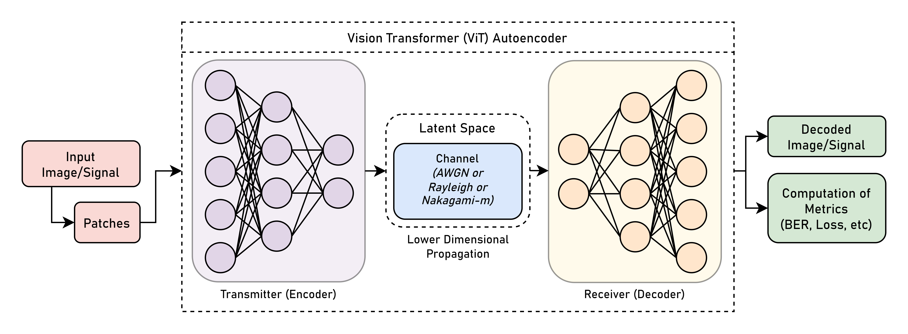

# AeCC: Autoencoders for Compressed Communication

[](https://opensource.org/licenses/MIT)
[](https://pytorch.org/)

In the field of communication systems, the transmission of images over noisy channels poses a significant challenge. To address this challenge, a novel communication system is proposed that employs a vision transformer-based autoencoder for image compression and a denoising network for noise removal. The proposed system operates by first encoding the input image into a lower-dimensional latent space representation using the vision transformer-based autoencoder. This compressed representation is then transmitted through a noisy channel, where it is inevitably corrupted by noise. At the receiver, the denoising network is employed to reconstruct the original image from the received, noisy representation.

## Block Diagram


## Installation
To get started with this project, follow the steps below:

- Clone the repository to your local machine using the following command:

    ```fish
    git clone https://github.com/muhd-umer/aecc.git
    ```

- It is recommended to create a new virtual environment so that updates/downgrades of packages do not break other projects. To create a new virtual environment, run the following command:

    ```fish
    conda env create -f environment.yml
    ```

- Alternatively, you can use `mamba` (faster than conda) package manager to create a new virtual environment:

    ```fish
    wget -O miniforge.sh \
         "https://github.com/conda-forge/miniforge/releases/latest/download/Miniforge3-$(uname)-$(uname -m).sh"
    bash miniforge.sh -b -p "${HOME}/conda"

    source "${HOME}/conda/etc/profile.d/conda.sh"

    # For mamba support also run the following command
    source "${HOME}/conda/etc/profile.d/mamba.sh"

    conda activate
    mamba env create -f environment.yml
    ```

- Activate the newly created environment:

    ```fish
    conda activate aecc
    ```

- Install the PyTorch Ecosystem:

    ```fish
    # pip will take care of necessary CUDA packages
    pip3 install torch torchvision torchaudio

    # additional packages (already included in environment.yml)
    pip3 install einops python-box timm torchinfo \
                 pytorch-lightning rich wandb rawpy
    ```

## Dataset
A custom Imagenette dataset is used for training and testing the model. The dataset can be downloaded from [here](https://github.com/muhd-umer/aecc/releases/tag/v0.0.1).

Or, you can use the following commands to download the dataset:

```fish
wget -O imagenette.zip \
    "https://github.com/muhd-umer/aecc/releases/download/v0.0.1/imagenette320p.zip"

# unzip the dataset
unzip -q data/imagenette.zip -d data/
```

CIFAR100 can be downloaded from [here](https://www.cs.toronto.edu/~kriz/cifar.html).

Or, you can use the following commands to download the dataset:

```fish
# download as python pickle
cd data
curl -O https://www.cs.toronto.edu/~kriz/cifar-100-python.tar.gz
tar -xvzf cifar-100-python.tar.gz

# download as ImageNet format
pip3 install cifar2png
cifar2png cifar100 data/cifar100
```

For MNIST, `torchvision` can be used to download the dataset:

```fish
# download MNIST dataset
python3 -c "import torchvision; torchvision.datasets.MNIST('data/', download=True)"
```

## Training
To train the model from scratch, run the following command:

```fish  
# train the model from scratch using default config
python3 train.py --model-name MODEL_NAME \  # name of the model
                 --dataset DATASET  # name of the dataset

# Train the model from scratch using overrides
python3 train.py --model-name MODEL_NAME \  # name of the model
                 --dataset DATASET \  # name of the dataset
                 --model-cfg MODEL_CFG \  # path to the model config file
                 --data-cfg DATA_CFG \  # path to the data config file
                 --data-dir DATA_DIR \  # directory containing data
                 --model-dir MODEL_DIR \  # directory to save model
                 --batch-size BATCH_SIZE \  # batch size
                 --num-workers NUM_WORKERS \  # number of workers
                 --num-epochs NUM_EPOCHS \  # number of epochs
                 --lr LR \  # learning rate
                 --val-size VAL_SIZE \  # validation size
                 --noise-factor NOISE_FACTOR \  # noise factor
                 --loss LOSS \  # loss function (mse, lpips)
                 --rich-progress \  # use rich progress bar
                 --accelerator ACCELERATOR \  # type of accelerator
                 --devices DEVICES \  # devices to use for training
                 --weights WEIGHTS \  # path to weights file
                 --resume \  # resume training from the provided weights
                 --test-only \  # only test the model, do not train
                 --logger-backend LOGGER_BACKEND \  # logger backend (tensorboard, wandb)
                 --normalize NORMALIZE \  # normalize the data (default, norm_0to1, norm_neg1to1)
                 --val-freq VAL_FREQ  # validate every n epochs
```

## Project Structure
The project is structured as follows:

```shell
aecc
├── config/           # configuration directory
├── data/             # data directory
├── models/            # model directory
├── resources/        # resources directory
├── utils/            # utility directory
├── LICENSE           # license file
├── README.md         # readme file
├── environment.yml   # conda environment file
├── upscale.py        # upscaling script
└── train.py           # training script
```

## Contributing ❤️
Pull requests are welcome. For major changes, please open an issue first to discuss what you would like to change.
